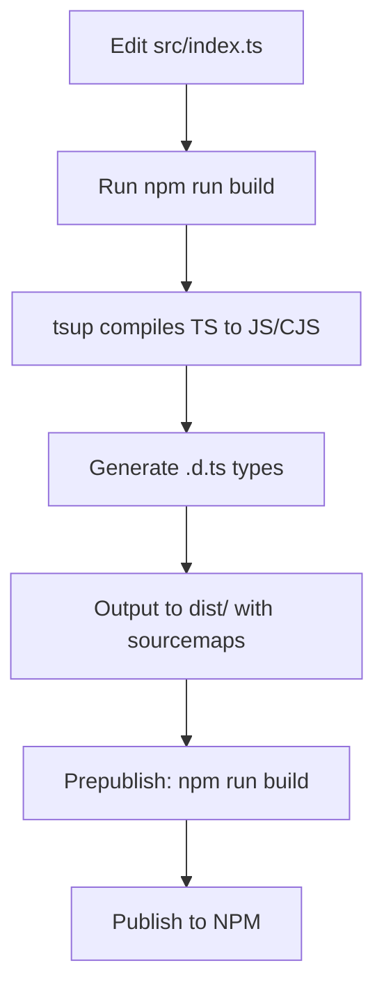
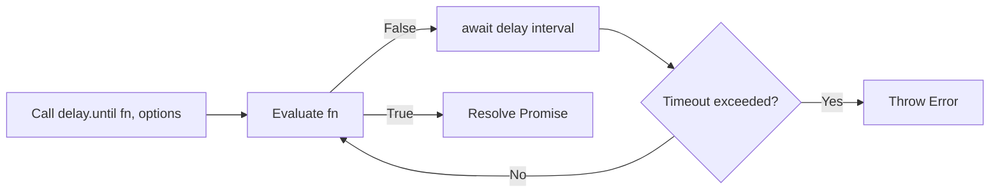

# Product Requirements Document (PRD) for deca-delay NPM Package

## Executive Summary

**Product Name:** deca-delay 
**Version:** 1.0.0 (Initial Release)  
**Overview:** deca-delay is a lightweight, modern NPM package providing enhanced asynchronous delay utilities for Node.js applications, particularly suited for automation scripts, bots, and testing frameworks like Playwright or Puppeteer. It extends the basic `setTimeout` functionality with intuitive APIs for fixed delays, random delays, and conditional waiting (polling until a condition is met). The package emphasizes simplicity, type safety, and zero-configuration setup, making it ideal for developers needing reliable timing controls without boilerplate code.

**Key Benefits:**
- **Simplicity:** Clean APIs like `await delay(1500)` or `await delay.until(() => ready === true)`.
- **Flexibility:** Supports random delays for jitter in retries/backoffs and polling with customizable intervals/timeouts.
- **Type Safety:** Built with TypeScript, providing automatic type definitions for better developer experience.
- **Modularity:** Adheres to SOLID principles, ensuring each function has a single responsibility and can be extended without modification.
- **Compatibility:** Dual ESM/CJS builds for broad Node.js ecosystem support.
- **Target Audience:** Node.js developers, automation engineers, bot creators, and testers.

**Success Metrics:**
- 100+ downloads in the first month post-publish.
- Positive feedback on NPM (stars, issues resolved).
- Integration examples in popular repos (e.g., via GitHub searches).
- Zero critical bugs in initial release.

**Timeline:** Development: 2-4 weeks; Testing: 1 week; Publish: Immediate after QA.

**Risks:** Name collision on NPM (mitigate by scoping to `@yourname/deca-delay`); Dependency vulnerabilities (use audited tools like tsup and TypeScript).

## Technical Summary

**Tech Stack:**
- **Language:** TypeScript (for type safety and developer ergonomics).
- **Build Tools:** tsup (zero-config bundler for ESM/CJS formats with sourcemaps and .d.ts generation).
- **Dependencies:** None (core runtime); Dev dependencies: typescript, tsup, @types/node.
- **Environment:** Node.js >= 14 (ES2020 target for modern features like async/await).
- **Architecture:** Modular design following SOLID principles:
  - **Single Responsibility Principle (SRP):** Each function (delay, random, until) handles one concern.
  - **Open-Closed Principle (OCP):** Functions are extensible via options without modifying core code (e.g., add hooks later).
  - **Liskov Substitution Principle (LSP):** Interfaces ensure substitutable behaviors (e.g., sync/async condition functions).
  - **Interface Segregation Principle (ISP):** Narrow interfaces (e.g., DelayUntilOptions) avoid fat APIs.
  - **Dependency Inversion Principle (DIP):** High-level modules depend on abstractions (e.g., Promise-based returns).
- **Modular Design:** Core logic in `src/index.ts` as a single module export; future expansions can add sub-modules (e.g., `src/advanced.ts`).
- **Output Artifacts:** dist/ folder with index.js (ESM), index.cjs (CJS), index.d.ts (types).
- **Testing:** Local linking and manual scripts; plan for Jest integration in future epics.
- **Deployment:** NPM publish with public access; GitHub repo for source control and CI/CD (e.g., GitHub Actions for builds).

**Key Decisions:**
- No external runtime deps to keep bundle size < 1KB.
- Polling in `until` uses default 200ms interval to balance responsiveness and CPU usage.
- Error handling: Throw on invalid inputs (e.g., min > max in random) or timeouts.
- Documentation: README.md with examples, API reference, and install instructions.

## List of Epics

Epics represent high-level feature groups. Each epic breaks into user stories for granularity.

1. **Epic 1: Core Delay Functions** - Implement basic and advanced delay mechanisms.
2. **Epic 2: Build and Packaging Pipeline** - Set up tooling for compilation, bundling, and distribution.
3. **Epic 3: Documentation and Examples** - Create user-facing docs and usage demos.
4. **Epic 4: Testing and Quality Assurance** - Ensure reliability through local and automated tests.
5. **Epic 5: Publishing and Maintenance** - Deploy to NPM and plan for ongoing support.

## List of User Stories

User stories are granular, formatted as: "As a [role], I want [feature] so that [benefit]". Prioritized by epic.

### Epic 1: Core Delay Functions
- As a developer, I want a fixed delay function so that I can pause execution for a specific time (e.g., await delay(1500)).
- As an automation engineer, I want a random delay function so that I can introduce jitter in scripts to avoid rate limits (e.g., await delay.random(500, 3000)).
- As a tester, I want a conditional delay (until) function supporting sync conditions so that I can wait for state changes (e.g., await delay.until(() => ready === true)).
- As a tester, I want the until function to support async conditions so that I can integrate with async APIs (e.g., await delay.until(async () => await page.isVisible("#loaded"))).
- As a developer, I want customizable options for until (interval, timeout) so that I can fine-tune polling behavior.
- As a developer, I want error handling in random (min <= max check) so that invalid inputs are caught early.
- As a developer, I want timeout errors in until so that infinite loops are prevented.

### Epic 2: Build and Packaging Pipeline
- As a maintainer, I want a TypeScript config for ES2020 targeting so that code is modern and type-safe.
- As a maintainer, I want tsup configuration for ESM/CJS/d.ts outputs so that the package supports multiple environments.
- As a maintainer, I want a package.json with correct entry points (main, module, types) so that imports work seamlessly.
- As a maintainer, I want a build script (npm run build) so that artifacts are generated consistently.
- As a maintainer, I want prepublish hook to run build so that only built files are published.
- As a maintainer, I want files field in package.json limited to dist/ so that only necessary artifacts are included.

### Epic 3: Documentation and Examples
- As a user, I want a README.md with install instructions so that I can quickly set up the package.
- As a user, I want API documentation in README so that I understand function signatures and options.
- As a user, I want code examples in README for each function so that I can copy-paste and adapt.
- As a maintainer, I want keywords in package.json so that the package is discoverable on NPM.

### Epic 4: Testing and Quality Assurance
- As a developer, I want local linking (npm link) support so that I can test the package in a separate project.
- As a tester, I want a sample test script demonstrating all functions so that I verify behavior.
- As a maintainer, I want sourcemaps in builds so that debugging is easier.

### Epic 5: Publishing and Maintenance
- As a maintainer, I want NPM login and publish scripts so that I can deploy publicly.
- As a maintainer, I want name availability checks so that collisions are avoided (fallback to scoped name).
- As a maintainer, I want a MIT license so that the package is open-source friendly.
- As a maintainer, I want a GitHub repo setup so that source is version-controlled and issues can be tracked.

## Breakdown into Feature Branches and PRs

Based on epics and stories, we use a Git flow-inspired approach: Feature branches from main, merged via PRs. Each branch focuses on modular changes (SOLID-compliant). Assume repo initialized with `git init` and main branch.

### Branching Strategy
- **Main Branch:** Stable releases.
- **Feature Branches:** Named `feature/epic-number-story-slug` (e.g., `feature/1-fixed-delay`).
- **PRs:** Each branch -> PR with description, tests, and modular commits. Review for SOLID adherence (e.g., no god functions).

#### Epic 1: Core Delay Functions (Branches/PRs)
- Branch: `feature/1-fixed-delay` → PR #1: Implement basic delay function with types and exports. (Stories: fixed delay).
- Branch: `feature/1-random-delay` → PR #2: Add random delay as static method with error handling. (Stories: random delay, error handling).
- Branch: `feature/1-until-sync` → PR #3: Implement until for sync conditions with default options. (Stories: sync until, options).
- Branch: `feature/1-until-async` → PR #4: Extend until to support async functions. (Stories: async until).
- Branch: `feature/1-until-timeout` → PR #5: Add timeout logic and error throwing. (Stories: timeout errors).

#### Epic 2: Build and Packaging Pipeline (Branches/PRs)
- Branch: `feature/2-ts-config` → PR #6: Set up tsconfig.json for compilation. (Stories: TS config).
- Branch: `feature/2-tsup-config` → PR #7: Add tsup.config.ts for bundling. (Stories: tsup config).
- Branch: `feature/2-package-json` → PR #8: Configure package.json entries, scripts, and files. (Stories: package.json setup, prepublish).

#### Epic 3: Documentation and Examples (Branches/PRs)
- Branch: `feature/3-readme-install-api` → PR #9: Create README.md with install, API, and basic examples. (Stories: install, API docs).
- Branch: `feature/3-readme-examples` → PR #10: Add detailed code examples to README. (Stories: examples).
- Branch: `feature/3-package-keywords` → PR #11: Update package.json keywords. (Stories: keywords).

#### Epic 4: Testing and Quality Assurance (Branches/PRs)
- Branch: `feature/4-local-link` → PR #12: Document and test npm link process. (Stories: local linking).
- Branch: `feature/4-sample-tests` → PR #13: Add test-deca-delay folder with sample script. (Stories: test script).
- Branch: `feature/4-sourcemaps` → PR #14: Enable sourcemaps in tsup. (Stories: sourcemaps).

#### Epic 5: Publishing and Maintenance (Branches/PRs)
- Branch: `feature/5-license` → PR #15: Add LICENSE file (MIT). (Stories: license).
- Branch: `feature/5-publish-scripts` → PR #16: Document npm login/publish steps in README. (Stories: publish scripts, name checks).

After all PRs merged, tag v1.0.0 and publish.

## Examples

### Code Example: Basic Usage
```typescript
import { delay } from 'deca-delay';

async function main() {
  console.log('Start');
  await delay(1000); // Fixed delay
  console.log('After 1s');
  await delay.random(500, 2000); // Random delay
  console.log('After random');
  let ready = false;
  setTimeout(() => ready = true, 1500);
  await delay.until(() => ready, { interval: 100, timeout: 3000 }); // Conditional
  console.log('Ready!');
}

main();
```

### Code Example: Automation Integration (Playwright)
```typescript
import { delay } from 'deca-delay';
import { chromium } from 'playwright';

async function automate() {
  const browser = await chromium.launch();
  const page = await browser.newPage();
  await page.goto('https://example.com');
  await delay.until(async () => await page.isVisible('#loaded'), { timeout: 10000 });
  console.log('Page loaded!');
  await browser.close();
}

automate();
```

## Flow Diagrams

### Build Process Flow (Mermaid)


### Usage Flow for delay.until (Mermaid)

